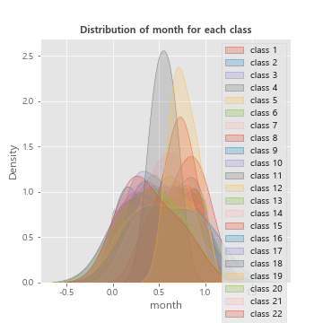
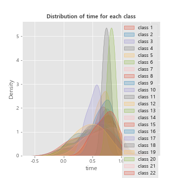
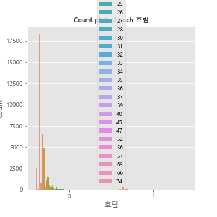
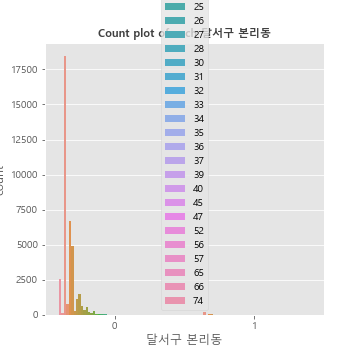
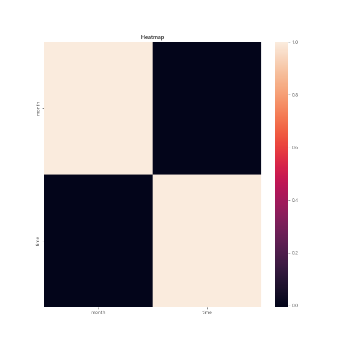

## Bivariate analysis of month feature with target

------------------------------------------------------
## Bivariate analysis of time feature with target

------------------------------------------------------
## Bivariate analysis of 금요일 feature with target

------------------------------------------------------
## Bivariate analysis of 목요일 feature with target

------------------------------------------------------
## Bivariate analysis of 수요일 feature with target

------------------------------------------------------
## Bivariate analysis of 월요일 feature with target

------------------------------------------------------
## Bivariate analysis of 일요일 feature with target

------------------------------------------------------
## Bivariate analysis of 토요일 feature with target

------------------------------------------------------
## Bivariate analysis of 화요일 feature with target

------------------------------------------------------
## Bivariate analysis of 기상상태-기타 feature with target

------------------------------------------------------
## Bivariate analysis of 눈 feature with target

------------------------------------------------------
## Bivariate analysis of 맑음 feature with target

------------------------------------------------------
## Bivariate analysis of 비 feature with target

------------------------------------------------------
## Bivariate analysis of 흐림 feature with target

------------------------------------------------------
## Bivariate analysis of 남구 대명동 feature with target

------------------------------------------------------
## Bivariate analysis of 남구 봉덕동 feature with target

------------------------------------------------------
## Bivariate analysis of 남구 이천동 feature with target

------------------------------------------------------
## Bivariate analysis of 달서구 갈산동 feature with target

------------------------------------------------------
## Bivariate analysis of 달서구 감삼동 feature with target

------------------------------------------------------
## Bivariate analysis of 달서구 대곡동 feature with target

------------------------------------------------------
## Bivariate analysis of 달서구 대천동 feature with target

------------------------------------------------------
## Bivariate analysis of 달서구 도원동 feature with target

------------------------------------------------------
## Bivariate analysis of 달서구 두류동 feature with target

------------------------------------------------------
## Bivariate analysis of 달서구 본동 feature with target

------------------------------------------------------
## Bivariate analysis of 달서구 본리동 feature with target

------------------------------------------------------
## Heatmap

------------------------------------------------------
